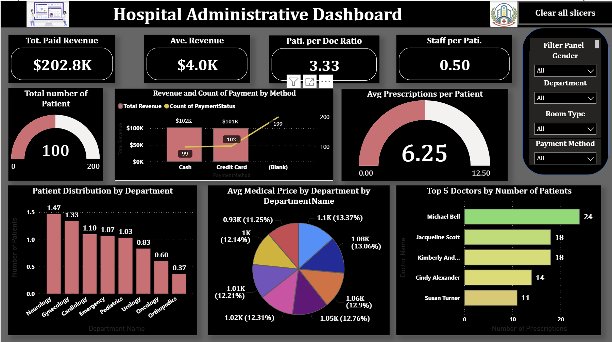

# Hospital Administration Power BI Dashboard

## Project Overview

This Power BI dashboard is part of a comprehensive **Hospital Data Management System**. It provides interactive visualizations and key insights to support hospital administrators, staff, and decision-makers in managing operations efficiently.

The system uses a relational database to handle key entities such as patients, doctors, departments, appointments, medical records, prescriptions, billing, rooms, and staff. Fake data was generated using Python's Faker library to populate the tables with realistic volumes of records.

## Live Dashboard

[Muluwerk_Derebe-PowerBI_Public_Repository](https://app.powerbi.com/groups/me/reports/31e6ef06-5eb2-4621-838b-285821c42c06/b13724fdcf497469a289?experience=power-bi)

## Dashboard Screenshot

  

<grok-card data-id="49d80f" data-type="image_card" data-plain-type="render_searched_image"  data-arg-image_id="E7FLN"  data-arg-size="LARGE" ></grok-card>

<grok-card data-id="ea3cd8" data-type="image_card" data-plain-type="render_searched_image"  data-arg-image_id="4JrJn"  data-arg-size="LARGE" ></grok-card>

## Features

- **Interactive Visualizations**: Dynamic charts, KPIs, and slicers for exploring hospital metrics.
- **Business Insights**: Answers 15 key business questions related to revenue, patient trends, doctor workload, department performance, room utilization, and more.
- **Data-Driven Decision Making**: Helps identify top-performing departments (e.g., Urology for revenue), common diagnoses (e.g., Arthritis), and demographic patterns (e.g., average patient age of 44).
- **Access Control Demonstration**: Includes an admin user and read-only regular users (via SQL Server).

## Key Metrics & Insights

- **Revenue Analysis**: Breakdown by department, doctor, and time period.
- **Patient & Appointment Trends**: Volume, average appointments per patient, and patterns over the last 6 months.
- **Workload & Utilization**: Doctor workload, room occupancy, and hospital stay durations by room type.
- **Prescription & Diagnosis Patterns**: Most common diagnoses and medication trends.
- **Billing & Financial Overview**: Patient billing summaries and overall revenue.

## Technologies Used

- **Power BI**: For dashboard creation, DAX measures, relationships, and visualizations.
- **SQL Server**: Backend database with 11 interconnected tables, constraints, joins, and stored procedures/views.
- **Python (Faker)**: Data generation for hundreds of realistic records.
- **ER Modeling**: Conceptual (Mermaid) and physical database schemas.

## How to Use the Dashboard

1. Open the `.pbix` file in Power BI Desktop.
2. Use slicers/filters (e.g., by department, doctor, date range) to interact with visuals.
3. Explore tabs/pages focused on different areas: Revenue, Patients, Appointments, etc.
4. Refresh data if connected to the SQL database.

## Database Structure Highlights

- **Core Tables**: Patients, Doctors, Departments, Appointments, Medical Records, Prescriptions, Medicines, Billing, Staff, Rooms, Room Assignments.
- **Relationships**: Properly defined with primary/foreign keys for integrity (see ER diagram in project docs).

## Business Questions Answered

Examples include:
- Average appointments per patient in the last 6 months.
- Revenue by department/doctor.
- Room utilization and average hospital stay by room type.
- ... (15 total queries implemented via SQL + Power BI visuals).

## Challenges & Solutions

- Generating large volumes of test data: Solved using Python Faker with loops for efficient INSERT statements.
- Complex joins/aggregations: Handled via optimized SQL queries and Power BI modeling.

## Conclusion

This dashboard demonstrates how relational data modeling combined with powerful BI tools can deliver actionable insights for hospital management, improving efficiency, resource allocation, and patient care.

For the full project (including SQL DDL, queries, ER diagrams, and source data), refer to the accompanying files.

---

**Author**: Muluwerk Derebe  
**Status**: Completed (Individual/Group Project Component)  
**Last Updated**: June 2026
